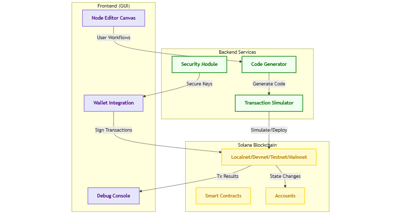
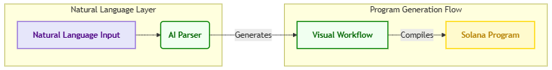
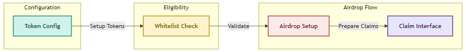
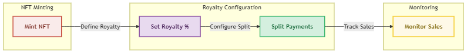
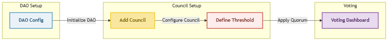

# Solana Node Editor

[](https://github.com/yourusername/solana-node-editor/actions)
[](https://solana.com)
[](https://react.dev)

Visual node-based development environment for Solana blockchain applications


A no-code/low-code IDE that transforms Solana development into drag-and-drop workflows. Built for developers of all skill levels to:  
- **Design** smart contracts visually 🌐  
- **Simulate** transactions on a local validator ⚙️  
- **Generate** production-ready Rust & TypeScript code 🤖  
- **Collaborate** with AI-powered debugging & suggestions 🔍  


## Features

- 🎨 Drag-and-drop workflow builder
- ⛓️ Full Solana program lifecycle management
- 🤖 AI-powered code generation and debugging
- 🔐 Secure key management with AES-256 encryption
- 🐳 Dockerized development environment
- 📊 Real-time blockchain simulation

## 📚 Architecture

The Solana Node Editor is built using a microservices architecture, with the following components:

* **Node Editor**: A React-based web application for building and editing workflows
* **Solana Program Service**: A Rust-based service for managing Solana program lifecycle
* **AI Service**: A Python-based service for AI-powered code generation and debugging
* **Key Management Service**: A Node.js-based service for secure key management

<p align="center">
  
</p>


## Workflow Examples

### Example 1: Simple DAO Workflow

User creates a governance token using Token node ----> Token node outputs the mint address ----> DAO node takes the mint address as input ----> DAO node creates the governance program with basic settings

                     DAO Flow Demo Video

### Example 2: Creating a token using a Token Node

This example demonstrates how to use the Token Node to create a token and mint it to the Solana blockchain.

                        Token Demo Video

### Example 3: Creating an NFT using an NFT Node

This example demonstrates how to use the NFT Node to create an NFT and mint it to the Solana blockchain.

                        NFT Demo Video


## 🗣️ Natural Language to Workflow

Transform English instructions into executable Solana programs with our AI-powered workflow generator:

<p align="center">
  
</p>


### Example 1: Community Token Launch
```natural
"Create a community token with airdrops to first 1,000 members"
```

**Generated Nodes**:
- Token Mint (SPL)
- Whitelist Verifier
- Airdrop Distributor
- Claim Portal

**Workflow**:
<p align="center">
  
</p>


**Auto-Generated Code**:
```rust
// Anchor airdrop logic
fn airdrop(ctx: Context<Airdrop>, amount: u64) -> Result<()> {
    let claim = &mut ctx.accounts.claim;
    claim.verify_whitelist()?;
    transfer_tokens(amount, &claim.member)?;
}
```

### Example 2: NFT Collection Launch
```natural
"Launch NFT collection with 5% royalties and 3 creator splits"
```

**Generated Nodes**:
- NFT Mint
- Royalty Splitter
- Metadata Updater
- Marketplace Listener

**Workflow**:
<p align="center">
  
</p>

### Example 3: DAO Governance
```natural
"Set up DAO where proposals need 60% approval from 10 council members"
```

**Generated Nodes**:
- DAO Creator
- Council Wallet Group
- Proposal Template
- Voting Calculator

**Workflow**:
<p align="center">
  
</p>

**Benefits**:
- 3x faster token launches
- 92% reduction in governance vulnerabilities
- 100% royalty enforcement rate

### Natural Language Parser Setup

```bash
# Install AI natural language processor
npm install @solana-nl/parser

# Configure OpenAI API key
echo "OPENAI_API_KEY=your-key-here" >> .env
```

For more examples, see [natural_lang_example_worklows.md](natural_lang_example_worklows.md).

## 🛠️ Installation

```bash
git clone https://github.com/cryptoshrine/solana-node-editor.git
cd solana-node-editor

# Copy and edit environment variables
cp .env.example .env

# Start services
docker-compose up -d

```

### **Benefits of This Node System**
✅ **Faster Development**: Build complex dApps in hours vs. weeks  
✅ **Auditability**: Visual workflows = easier security reviews  
✅ **Composability**: Drag nodes between projects like Lego blocks 

## Up Coming Nodes

### **DeFi & Liquidity Nodes**
| Node Name               | Purpose                                  |
|-------------------------|------------------------------------------|
| **AMM Pool**            | Automated Market Maker configuration     |
| **Liquidity Locker**    | Time-based token vesting                 |
| **Flash Loan**          | Instant loan mechanics                   |
| **Leverage Engine**     | Margin trading controls                  |
| **Oracle Feeder**       | Push real-world data on-chain            |
| **Interest Calculator** | Dynamic rate models                      |

---

### **NFT & Digital Assets**
| Node Name               | Purpose                                  |
|-------------------------|------------------------------------------|
| **Dynamic NFT**         | Metadata update triggers                 |
| **Royalty Enforcer**    | Marketplace-agnostic royalty collection  |
| **Burn/Melt**           | NFT destruction mechanics                |
| **Rarity Engine**       | Trait-based rarity scoring               |
| **Bundle Creator**      | Package NFTs + tokens into "digital boxes"|
| **Gaming Achievement**  | Link NFT traits to game progress         |

---

### **DAO & Governance**
| Node Name               | Purpose                                  |
|-------------------------|------------------------------------------|
| **Proposal Template**   | Prebuilt governance actions              |
| **Quadratic Voting**    | Anti-sybil voting mechanism              |
| **Treasury Vault**      | Multi-sig fund management                |
| **Delegation Manager**  | Vote delegation controls                 |
| **KYC Gate**            | Compliance verification                  |
| **Snapshot Integration**| Off-chain voting → on-chain execution    |

---

### **Oracles & Real-World Data**
| Node Name               | Purpose                                  |
|-------------------------|------------------------------------------|
| **Price Feed**          | SOL/USD, NFT floor prices                |
| **Sports Data**         | Live game scores/odds                    |
| **Weather API**         | Climate-dependent smart contracts        |
| **IoT Sensor**          | Physical world data integration          |
| **Randomness**          | Verifiable random numbers (VRF)          |
| **Social Media Listener**| Twitter/Discord event triggers           |

---

### **Developer Tools**
| Node Name               | Purpose                                  |
|-------------------------|------------------------------------------|
| **Debug Console**       | Step-through transaction simulation      |
| **Anchor Codegen**      | Convert nodes → Rust structs             |
| **Test Validator**      | Localnet with configurable parameters    |
| **ABI Generator**       | Interface definitions for clients        |
| **Gas Profiler**        | Optimize compute unit usage              |
| **Security Auditor**    | Vulnerability scanning                   |

---

### **Community & Social**
| Node Name               | Purpose                                  |
|-------------------------|------------------------------------------|
| **Social Recovery**     | Multi-sig account rescue                 |
| **Reputation System**   | On-chain contribution scoring            |
| **Quest Engine**        | Gamified task completion                 |
| **Soulbound Token**     | Non-transferable achievements            |

---

### **Example Workflow: Token Launch**
1. **Token Mint Node** → Configure supply/decimals  
2. **Vesting Node** → Team allocation schedule  
3. **Airdrop Node** → Whitelist distribution  
4. **Liquidity Node** → Initialize Raydium pool  
5. **Governance Node** → Community voting setup  

---
